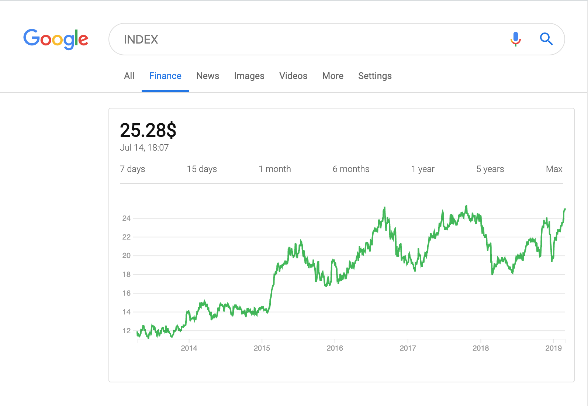

# Google Finance

Re-implementing Google finance page with Vuejs and D3js. Try it here: [https://vue-google-finance.surge.sh](https://vue-google-finance.surge.sh).



## Want to try locally?

### Install the dependencies
```
npm install
```

### Compiles and hot-reloads for development
```
npm run serve
```

### Compiles and minifies for production
```
npm run build
```

### Run your tests
```
npm run test
```

### Lints and fixes files
```
npm run lint
```

### Run your unit tests
```
npm run test:unit
```

## License

MIT License